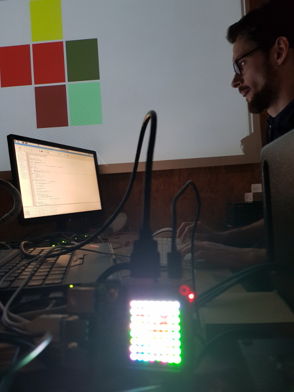

# 2020-02-04

Coding Dojo: A Flask webserver with websockets support allows to update the Raspberry Pi Sense Hat LED matrix

This repository contains the resulting source code (server.py). Javascript is provided by [socket.is](https://socket.io/docs/client-api/) and @meisterluk. HTML and CSS is provided by @meisterluk.

## License

MIT license

